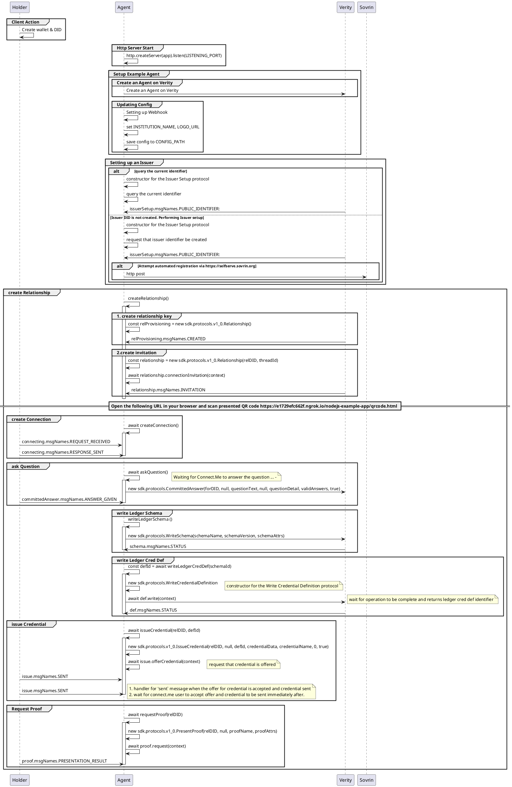

```plantuml
@startuml
    group Client Action
    Holder -> Holder : Create wallet & DID
    end

    group Http Server Start 
    Agent -> Agent: http.createServer(app).listen(LISTENING_PORT)
    end


    group Setup Example Agent
    
    group Create an Agent on Verity 
        Agent -> Verity :  Create an Agent on Verity 
    end


    group Updating Config
        Agent -> Agent : Setting up Webhook

        Agent -> Agent : set INSTITUTION_NAME, LOGO_URL

        Agent -> Agent : save config to CONFIG_PATH
       
        end note
    end

    group Setting up an Issuer
        alt query the current identifier
            Agent -> Agent : constructor for the Issuer Setup protocol

            Agent -> Agent : query the current identifier
            
            Verity -> Agent: issuerSetup.msgNames.PUBLIC_IDENTIFIER:

        else Issuer DID is not created. Performing Issuer setup 
        
            Agent -> Agent : constructor for the Issuer Setup protocol

            Agent -> Agent : request that issuer identifier be created
            

            Verity -> Agent: issuerSetup.msgNames.PUBLIC_IDENTIFIER:


            alt Attempt automated registration via https://selfserve.sovrin.org
                Agent -> Sovrin : http post
            end
        end
    end

    group create Relationship
        Agent -> Agent : createRelationship()
        activate Agent
        
        group 1. create relationship key
            Agent -> Agent : const relProvisioning = new sdk.protocols.v1_0.Relationship()
            Verity -> Agent : relProvisioning.msgNames.CREATED
        end
        
        group 2.create invitation
            Agent -> Agent : const relationship = new sdk.protocols.v1_0.Relationship(relDID, threadId)
            Agent -> Agent : await relationship.connectionInvitation(context)

            Verity -> Agent : relationship.msgNames.INVITATION
            
        end
        deactivate Agent

    == Open the following URL in your browser and scan presented QR code https://e1729efc662f.ngrok.io/nodejs-example-app/qrcode.html ==

    group create Connection
        Agent -> Agent : await createConnection()
        activate Agent

        Holder -> Agent : connecting.msgNames.REQUEST_RECEIVED

        Holder -> Agent : connecting.msgNames.RESPONSE_SENT

        deactivate Agent
    end

    group ask Question
        Agent -> Agent : await askQuestion()
        activate Agent
        note right
        Waiting for Connect.Me to answer the question ... -
        end note
        
        Agent -> Verity : new sdk.protocols.CommittedAnswer(forDID, null, questionText, null, questionDetail, validAnswers, true)
        Holder -> Agent : committedAnswer.msgNames.ANSWER_GIVEN

        deactivate Agent
    end

    group write Ledger Schema
        Agent -> Agent : writeLedgerSchema ()
        activate Agent

        Agent -> Verity : new sdk.protocols.WriteSchema(schemaName, schemaVersion, schemaAttrs)
        
        Verity -> Agent : schema.msgNames.STATUS
        
        deactivate Agent

    end

    group write Ledger Cred Def
        Agent -> Agent : const defId = await writeLedgerCredDef(schemaId)
        activate Agent
        
        Agent -> Agent : new sdk.protocols.WriteCredentialDefinition
        note right
        constructor for the Write Credential Definition protocol
        end note
       
        Agent -> Verity: await def.write(context) 
        note right
        wait for operation to be complete and returns ledger cred def identifier
        end note

        Verity -> Agent: def.msgNames.STATUS
        
        deactivate Agent
    end

    group issue Credential
        Agent -> Agent : await issueCredential(relDID, defId)
        activate Agent
        Agent -> Agent : new sdk.protocols.v1_0.IssueCredential(relDID, null, defId, credentialData, credentialName, 0, true)

        Agent -> Agent : await issue.offerCredential(context)
        note right
        request that credential is offered
        end note

        Holder -> Agent: issue.msgNames.SENT
        
        Holder -> Agent: issue.msgNames.SENT
        note right
        1. handler for 'sent` message when the offer for credential is accepted and credential sent
        2. wait for connect.me user to accept offer and credential to be sent immediately after.
        end note
        deactivate Agent
    end 


    group Request Proof
        Agent -> Agent : await requestProof(relDID)
        activate Agent
        Agent -> Agent : new sdk.protocols.v1_0.PresentProof(relDID, null, proofName, proofAttrs)

        Agent -> Agent : await proof.request(context)
        Holder -> Agent : proof.msgNames.PRESENTATION_RESULT
        deactivate Agent
    end

end


    
@enduml
```