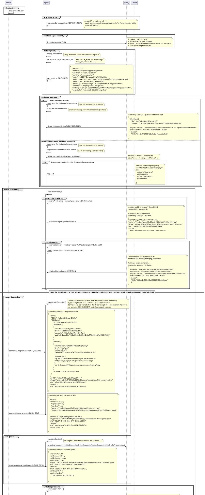

```plantuml
@startuml
    group Client Action
    Holder -> Holder : Create wallet & DID
    end

    group Http Server Start 
    Agent -> Agent: http.createServer(app).listen(LISTENING_PORT)
    note right
    app.post('/', async (req, res) => {
        await handlers.handleMessage(context, Buffer.from(req.body, 'utf8'))
        res.send('Success')
    })
    end note
    end


    group Setup Example Agent
    
    group Create an Agent on Verity 
        Agent -> Verity :  Create an Agent on Verity 
        note right
        1. Provide Provision Token
        2. Set Verity Application Endpoint
        3. Wallet Created: sdk.Context.create(NAME, KEY, verityUrl)
        4. await provision.provision(ctx)
        end note
    end


    group Updating Config
        Agent -> Agent : Setting up Webhook
        note right
        Using Webhook: https://a3f436d64210.ngrok.io
        end note

        Agent -> Agent : set INSTITUTION_NAME, LOGO_URL
        note right
        INSTITUTION_NAME = 'Faber College'
        LOGO_URL = 'bank-flat.png'
        end note

        Agent -> Agent : save config to CONFIG_PATH
        note right
        {
            "version": "0.2",
            "verityUrl": "https://vas.pps.evernym.com",
            "walletName": "examplewallet1",
            "walletKey": "examplewallet1",
            "verityPublicDID": "Sc1rzepMCAXWXMjK6yj6iR",
            "verityPublicVerKey": "ExPFLx4uNjF9jRQJV7XxAt8MfuXJENgbgA1qNmWznsRZ",
            "sdkVerKeyId": "AF8i9n1A45VPSAVEVznPrN",
            "sdkVerKey": "63DDgPazBgkCsNXKw6njzedPvCB861kWjkuVivGwT4TT",
            "domainDID": "NRJwf8Jcw4h5c7daDgPCBZ",
            "verityAgentVerKey": "33obNbHfBhUyzEPMnY6MEkW52qpaxd89ng3Z6s7nbMTs",
            "endpointUrl": "https://a3f436d64210.ngrok.io"
        }
        end note
    end

    group Setting up an Issuer
        alt query the current identifier
            Agent -> Agent : constructor for the Issuer Setup protocol
            note right
            new sdk.protocols.IssuerSetup()
            end note

            Agent -> Agent : query the current identifier
            note right
            await issuerSetup.currentPublicIdentifier(context)
            end note
            
            Verity -> Agent: issuerSetup.msgNames.PUBLIC_IDENTIFIER:
            note right
            Incomming Message -- public-identifier-created
            {
                "identifier": {
                    "did": "NmFoJTeyB6Pe5B7xm561n5",
                    "verKey": "CryNfL5qTmaVFwhBLtTgYHKXPeECtXpQDToM2MR4KUT3"
                },
                "@type": "did:sov:123456789abcdefghi1234;spec/issuer-setup/0.6/public-identifier-created",
                "@id": "9ebd77e3-7eb7-4851-a929-8482d544b3ad",
                "~thread": {
                    "thid": "61ee2ef9-3132-4b9a-9d3d-69edeadb8b2a"
                }
            }
            end note

        else Issuer DID is not created. Performing Issuer setup 
        
            Agent -> Agent : constructor for the Issuer Setup protocol
            note right
            new sdk.protocols.IssuerSetup()
            end note

            Agent -> Agent : request that issuer identifier be created
            note right
            await issuerSetup.create(context)
            end note

            Verity -> Agent: issuerSetup.msgNames.PUBLIC_IDENTIFIER:
            note right
            issuerDID = message.identifier.did
            issuerVerkey = message.identifier.verKey
            end note


            alt Attempt automated registration via https://selfserve.sovrin.org
                Agent -> Sovrin : http post
                note right
                const res = await request.post({
                uri: 'https://selfserve.sovrin.org/nym',
                json: {
                    network: 'stagingnet',
                    did: issuerDID,
                    verkey: issuerVerkey,
                    paymentaddr: ''
                }
                })
                end note 
            end
        end
    end

    group create Relationship
        Agent -> Agent : createRelationship()
        activate Agent
        
        group 1. create relationship key
            Agent -> Agent : const relProvisioning = new sdk.protocols.v1_0.Relationship()
            Verity -> Agent : relProvisioning.msgNames.CREATED
            note right
            const threadId = message['~thread'].thid
            const relDID = message.did

            Waiting to create relationship ... -
            Incomming Message -- created
            {
            "did": "CAYngU7PKmgUmHWUtHFmmt",
            "verKey": "75wGhzbWxs4gfEwQ9ezfQqkF6oJPtsX4Ty44evMM91pv",
            "@type": "did:sov:123456789abcdefghi1234;spec/relationship/1.0/created",
            "@id": "9c43fe95-d5f7-437e-8c78-f93fe258466c",
            "~thread": {
                "thid": "5f06eede-fddb-48a0-9858-5109e2a83ede"
            }
            }

            end note
        end
        
        group 2.create invitation
            Agent -> Agent : const relationship = new sdk.protocols.v1_0.Relationship(relDID, threadId)
            Agent -> Agent : await relationship.connectionInvitation(context)

            Verity -> Agent : relationship.msgNames.INVITATION
            note right
            const inviteURL = message.inviteURL
            await QRCode.toFile('qrcode.png', inviteURL)

            Waiting to create invitation ... -
            Incomming Message -- invitation
            {
                "inviteURL": "http://vas.pps.evernym.com:80/agency/msg?x",
                "invitationId": "51dd4f1a-7c50-49c1-bd91-75a8bcc1d34b",
                "@type": "did:sov:123456789abcdefghi1234;spec/relationship/1.0/invitation",
                "@id": "733ffeef-4602-439a-bb08-218d12af572f",
                "~thread": {
                    "thid": "5f06eede-fddb-48a0-9858-5109e2a83ede"
                    }
            }

            end note
        end
        deactivate Agent

    == Open the following URL in your browser and scan presented QR code https://e1729efc662f.ngrok.io/nodejs-example-app/qrcode.html ==

    group create Connection
        Agent -> Agent : await createConnection()
        activate Agent
        note right
        Connecting protocol is started from the Holder's side (ConnectMe)
        by scanning the QR code containing connection invitation
        Connection is established when the Holder accepts the connection on the device
        i.e. when the RESPONSE_SENT control message is received
        end note

        Holder -> Agent : connecting.msgNames.REQUEST_RECEIVED
        note right
        Incomming Message -- request-received
        {
            "conn": {
                "DID": "HNu9tohzJsXRyybHS1cTLn",
                "DIDDoc": {
                    "id": "HNu9tohzJsXRyybHS1cTLn",
                    "publicKey": [
                    {
                        "id": "HNu9tohzJsXRyybHS1cTLn#1",
                        "type": "Ed25519VerificationKey2018",
                        "controller": "HNu9tohzJsXRyybHS1cTLn",
                        "publicKeyBase58": "9vjBoKiHGFv9tKyUpcDCJwTTXp4bBRvWq6YS88KfkHCp"
                    }
                    ],
                    "service": [
                    {
                        "id": "did:example:123456789abcdefghi;indy",
                        "type": "IndyAgent",
                        "recipientKeys": [
                        "9vjBoKiHGFv9tKyUpcDCJwTTXp4bBRvWq6YS88KfkHCp"
                        ],
                        "routingKeys": [
                        "3iy1mZ9AhxPGuzXTtnE9sVVnHFPqiB3Cn8Mbvo4vccuo",
                        "844sJfb2snyeEugKvpY7Y4jZJk9LT6BnS6bnuKoiqbip"
                        ],
                        "serviceEndpoint": "https://agency.evernym.com/agency/msg"
                    }
                    ],
                    "@context": "https://w3id.org/did/v1"
                }
            },
            "myDID": "CAYngU7PKmgUmHWUtHFmmt",
            "@type": "did:sov:BzCbsNYhMrjHiqZDTUASHg;spec/connections/1.0/request-received",
            "@id": "afa6d900-e283-4904-b14c-cc97062c66ec",
            "~thread": {
            "thid": "4ac1a41a-37b4-422e-8ee5-104cc7842d73"
            }
        }
        end note

        Holder -> Agent : connecting.msgNames.RESPONSE_SENT
        note right
        Incomming Message -- response-sent
        {
            "resp": {
            "connection~sig": {
                "signature": "xx",
                "sig_data": "xx",
                "signer": "75wGhzbWxs4gfEwQ9ezfQqkF6oJPtsX4Ty44evMM91pv",
                "@type": "did:sov:BzCbsNYhMrjHiqZDTUASHg;spec/signature/1.0/ed25519Sha512_single"
            }
            },
            "myDID": "CAYngU7PKmgUmHWUtHFmmt",
            "@type": "did:sov:BzCbsNYhMrjHiqZDTUASHg;spec/connections/1.0/response-sent",
            "@id": "72e97c6b-ce98-425e-8779-36382ca533c9",
            "~thread": {
            "thid": "4ac1a41a-37b4-422e-8ee5-104cc7842d73",
            "sender_order": 0
            }
        }
        end note

        deactivate Agent
    end

    group ask Question
        Agent -> Agent : await askQuestion()
        activate Agent
        note right
        Waiting for Connect.Me to answer the question ... -
        end note
        
        Agent -> Verity : new sdk.protocols.CommittedAnswer(forDID, null, questionText, null, questionDetail, validAnswers, true)
        Holder -> Agent : committedAnswer.msgNames.ANSWER_GIVEN
        note right
        Incomming Message -- answer-given
        {
            "answer": "Great!",
            "valid_answer": true,
            "valid_signature": true,
            "not_expired": true,
            "@type": "did:sov:BzCbsNYhMrjHiqZDTUASHg;spec/committedanswer/1.0/answer-given",
            "@id": "5a5c4337-3d26-4da2-9f22-fdeb72a61857",
            "~thread": {
            "thid": "79c4c2e1-d400-4934-9154-17783a7c076a",
            "sender_order": 0,
            "received_orders": {
                "HNu9tohzJsXRyybHS1cTLn": 0
            }
            }
        }
        end note

        deactivate Agent
    end

    group write Ledger Schema
        Agent -> Agent : writeLedgerSchema ()
        activate Agent

        Agent -> Verity : new sdk.protocols.WriteSchema(schemaName, schemaVersion, schemaAttrs)
        note right
        // input parameters for schema
        const schemaName = 'Diploma ' + uuidv4().substring(0, 8)
        const schemaVersion = '0.1'
        const schemaAttrs = ['name', 'degree']// input parameters for schema
        const schemaName = 'Diploma ' + uuidv4().substring(0, 8)
        const schemaVersion = '0.1'
        const schemaAttrs = ['name', 'degree']
        end note 
        Verity -> Agent : schema.msgNames.STATUS
        note right
        Waiting to write schema to ledger ... -
        Incomming Message -- status-report
        {
            "schemaId": "NmFoJTeyB6Pe5B7xm561n5:2:Diploma bdbff13c:0.1",
            "@type": "did:sov:123456789abcdefghi1234;spec/write-schema/0.6/status-report",
            "@id": "f2a6e7d5-0d00-49b5-b757-f84763d5c24f",
            "~thread": {
            "thid": "c51b0d7f-a645-4ad8-be56-09513d35abcf"
            }
        }
        end note
        deactivate Agent

    end

    group write Ledger Cred Def
        Agent -> Agent : const defId = await writeLedgerCredDef(schemaId)
        activate Agent
        
        Agent -> Agent : new sdk.protocols.WriteCredentialDefinition
        note right
        constructor for the Write Credential Definition protocol

         // input parameters for cred definition
        const credDefName = 'Trinity College Diplomas'
        const credDefTag = 'latest'
        end note
       
        Agent -> Verity: await def.write(context) 
        note right
        wait for operation to be complete and returns ledger cred def identifier
        end note

        Verity -> Agent: def.msgNames.STATUS
        note right
        Incomming Message -- status-report
        {
            "credDefId": "NmFoJTeyB6Pe5B7xm561n5:3:CL:179064:latest",
            "@type": "did:sov:123456789abcdefghi1234;spec/write-cred-def/0.6/status-report",
            "@id": "86ca1ba2-8a66-4ad4-85e4-f5eeb215ef56",
            "~thread": {
            "thid": "3a096504-69b0-4b66-b2a9-7dca355a4d77"
            }
        }
        end note
        deactivate Agent
    end

    group issue Credential
        Agent -> Agent : await issueCredential(relDID, defId)
        activate Agent
        Agent -> Agent : new sdk.protocols.v1_0.IssueCredential(relDID, null, defId, credentialData, credentialName, 0, true)
        note right
        // input parameters for issue credential
        const credentialName = 'Degree'
        const credentialData = {
            name: 'Alice Smith',
            degree: 'Bachelors'
        }
        end note

        Agent -> Agent : await issue.offerCredential(context)
        note right
        request that credential is offered
        end note

        Holder -> Agent: issue.msgNames.SENT
        note right
          Incomming Message -- sent
            {
                "msg": {
                "credential_preview": {
                    "attributes": [
                    {
                        "name": "name",
                        "value": "Alice Smith"
                    },
                    {
                        "name": "degree",
                        "value": "Bachelors"
                    }
                    ],
                    "@type": "did:sov:BzCbsNYhMrjHiqZDTUASHg;spec/issue-credential/1.0/credential-preview"
                },
                "comment": "Degree",
                "price": "0",
                "offers~attach": [
                    {
                    "data": {
                        "base64": "xxx"
                    },
                    "@id": "libindy-cred-offer-0",
                    "mime-type": "application/json"
                    }
                ]
                },
                "@type": "did:sov:BzCbsNYhMrjHiqZDTUASHg;spec/issue-credential/1.0/sent",
                "@id": "6d8b2eec-9172-4d59-a284-cb7898f40c22",
                "~thread": {
                "thid": "6d8b2eec-9172-4d59-a284-cb7898f40c22",
                "sender_order": 0
                }
            }
        end note
        Holder -> Agent: issue.msgNames.SENT
        note right
        1. handler for 'sent` message when the offer for credential is accepted and credential sent
        2. wait for connect.me user to accept offer and credential to be sent immediately after.
        end note
        deactivate Agent
    end 


    group Request Proof
        Agent -> Agent : await requestProof(relDID)
        activate Agent
        Agent -> Agent : new sdk.protocols.v1_0.PresentProof(relDID, null, proofName, proofAttrs)
        note right
        // input parameters for request proof
        const proofName = 'Proof of Degree'
        const proofAttrs = [
            {
            name: 'name',
            restrictions: [{ issuer_did: issuerDID }]
            },
            {
            name: 'degree',
            restrictions: [{ issuer_did: issuerDID }]
            }
        ]

        // constructor for the Present Proof protocol
        end note  

        Agent -> Agent : await proof.request(context)
        Holder -> Agent : proof.msgNames.PRESENTATION_RESULT
        deactivate Agent
    end

end


    
@enduml
```